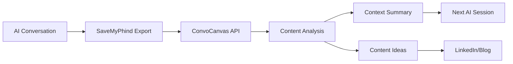

# ConvoCanvas

> **Bridge the context gap between AI conversations and long-term projects.**

ConvoCanvas transforms exported AI conversations into actionable content ideas and context summaries, solving the memory limitation problem that technical professionals face when working on complex, multi-session projects.

## 🧠 The Problem

As a network engineer transitioning into DevOps and automation, I've broken my Linux installs more times than I can count building local LLMs and complex infrastructure. But the real wall I hit wasn't technical—it was **context window limitations**.

AI services like Claude and Gemini forget everything between sessions. For any long-term technical project, their memory is too short. I found myself constantly re-explaining complex setups, architectural decisions, and troubleshooting context.

## 💡 The Solution

ConvoCanvas is my external memory for AI conversations. It processes exported chats and generates:

- **Context summaries** to re-prime the next AI session
- **Technical decision logs** from conversation history
- **Content ideas** (LinkedIn posts, blog topics) extracted from learning processes
- **Conversation themes** to track project evolution

**Real Impact**: Recently used ConvoCanvas to maintain context across a 3-day MPLS automation pipeline troubleshooting session—something impossible with standard AI chat limits.

## 🔧 How It Works

1. **Export** conversations using the [SaveMyPhind browser extension](https://github.com/Hugo-COLLIN/SaveMyPhind-conversation-exporter) by Hugo Collin
2. **Upload** to ConvoCanvas backend (FastAPI + Python)
3. **Process** conversations to extract key decisions, technical concepts, and learning moments
4. **Generate** content ideas and context summaries for future sessions



## 🚀 Quick Start

### Development Setup

```bash
# Clone and setup
git clone https://github.com/rduffyuk/convocanvas.git
cd convocanvas

# Backend (Python/FastAPI)
cd backend
python -m venv venv
source venv/bin/activate  # or `venv\Scripts\activate` on Windows
pip install -r requirements.txt
uvicorn app.main:app --reload --host 0.0.0.0 --port 8000

# Test the API
curl -X GET http://localhost:8000/
```

### Docker Setup

```bash
docker-compose up --build
```

### Try It Out

```bash
# Upload a conversation file
curl -X POST "http://localhost:8000/api/conversations/upload" \
  -H "accept: application/json" \
  -H "Content-Type: multipart/form-data" \
  -F "file=@your-conversation.md"

# Analyze content
curl -X POST "http://localhost:8000/api/conversations/analyze" \
  -H "accept: application/json" \
  -H "Content-Type: multipart/form-data" \
  -F "file=@your-conversation.md"
```

## 🏗️ Current Status

- ✅ **MVP Complete**: Core conversation parsing and content extraction
- ✅ **API Endpoints**: Upload and analyze conversations via REST API
- ✅ **Content Generation**: Extract LinkedIn posts, blog topics, technical concepts
- ✅ **SaveMyPhind Integration**: Parse exported conversation formats
- 🚧 **Web Interface**: Simple upload/analysis UI (planned)
- 📋 **Advanced Features**: AI-powered context summarization (planned)

## 🏛️ Architecture

- **Backend**: FastAPI + Python
  - Conversation parsing (`conversation_parser.py`)
  - Content analysis (`content_analyzer.py`) 
  - RESTful API endpoints (`/api/conversations/`)
- **Input**: Manual conversation exports (Markdown/TXT)
- **Processing**: Technical concept extraction, theme identification
- **Output**: Structured JSON with content suggestions

## 🛣️ Roadmap

### Phase 1: Core Platform ✅
- [x] Conversation file parser
- [x] Basic content extraction
- [x] API endpoints
- [x] SaveMyPhind format support

### Phase 2: Enhanced Analysis 🚧
- [ ] Context summarization for session continuity
- [ ] Technical decision tracking
- [ ] Multi-conversation thread analysis
- [ ] Web interface for easier testing

### Phase 3: Automation 📋
- [ ] Browser extension integration
- [ ] Automated content generation
- [ ] Export to content platforms
- [ ] Knowledge graph visualization

## 🎯 Use Cases

**For Technical Professionals:**
- Maintain context across multi-day debugging sessions
- Extract learning insights from AI-assisted problem solving
- Generate technical content from real troubleshooting experiences

**For Content Creators:**
- Transform technical conversations into blog post ideas
- Generate LinkedIn posts from learning moments
- Track technical learning journey over time

**For Career Transitioners:**
- Document skill development through AI conversations
- Create portfolio content from learning processes
- Bridge knowledge gaps between domains

## 🤝 Contributing

This started as a personal tool for my Windows→Linux→DevOps journey, but it's built to help anyone facing the AI context window problem. Contributions welcome!

**Built with conversations that ConvoCanvas now analyzes** - the entire project was planned in the very AI chats that it processes.

## 📋 Requirements

- Python 3.12+
- FastAPI
- SaveMyPhind browser extension for conversation exports

## 🔗 Related Projects

- [SaveMyPhind Extension](https://github.com/Hugo-COLLIN/SaveMyPhind-conversation-exporter) by Hugo Collin - Essential for exporting conversations
- Obsidian integration for manual knowledge management workflows

## 📄 License

MIT License - See [LICENSE](LICENSE) for details.

---

**From network engineering to automation, one conversation at a time.** 🌐→🤖
