# ConvoCanvas

> **🚀 Alpha Release - Core Features Working & Tested 🚀**

> **Bridge the context gap between AI conversations and long-term projects.**

ConvoCanvas transforms exported AI conversations into actionable content ideas and context summaries, solving the memory limitation problem that technical professionals face when working on complex, multi-session projects.

## ⚠️ Development Status

**Alpha Release - Core Features Working!** The MVP is functional with conversation analysis, decision tracking, and visualization capabilities tested and working. Still evolving with regular improvements. Suitable for experimentation and early adoption.

## 🧠 The Problem

As a network engineer transitioning into DevOps and automation, I've broken my Linux installs more times than I can count building local LLMs and complex infrastructure. But the real wall I hit wasn't technical—it was **context window limitations**.

AI services like Claude and Gemini forget everything between sessions. For any long-term technical project, their memory is too short. I found myself constantly re-explaining complex setups, architectural decisions, and troubleshooting context.

## 💡 The Solution

ConvoCanvas is my external memory for AI conversations. It processes exported chats and generates:

- **Context summaries** to re-prime the next AI session
- **Technical decision logs** from conversation history
- **Content ideas** (LinkedIn posts, blog topics) extracted from learning processes
- **Conversation themes** to track project evolution

**Real Impact**: Recently used ConvoCanvas to maintain context across a 3-day MPLS automation pipeline troubleshooting session—something impossible with standard AI chat limits.

## 🚀 **AI-Powered Productivity System** (v0.2.0-alpha)

ConvoCanvas is evolving into a comprehensive productivity engine combining AI conversation processing with knowledge management:

### **✅ Core Features** (Working & Tested)
- **Enhanced Analysis**: NLP-powered decision extraction with confidence scoring
- **Interactive Mindmaps**: Plotly-based decision flow visualizations
- **Sentiment Analysis**: Emotional context detection around decisions
- **Technical Domain Classification**: Auto-categorize conversations (AI/ML, DevOps, etc.)
- **Feature Flags System**: Environment-based feature toggles
- **Conversation Processing**: Parse and analyze AI chat exports

### **🚧 Experimental Features** (Alpha/Optional)
- **GPU Acceleration**: Optional GPU processing for high-end cards (RTX 4080/4090 tested)
- **Local AI Integration**: LM Studio compatibility for local models
- **Canvas Generation**: Visual output creation from conversations

### **📁 Knowledge Management** (In Progress)
- **Automated Organization**: Smart file categorization based on content
- **Metadata Generation**: Automatic tagging and frontmatter creation
- **Obsidian Integration**: Direct vault compatibility for knowledge bases

### **⚠️ Current Limitations**
- GPU features require NVIDIA cards with 12GB+ VRAM (but gracefully disabled if unavailable)
- Alpha software - expect UI/UX improvements in future releases
- Some advanced features still experimental
- Best suited for technical users familiar with API endpoints

### **🎛️ Feature Flags**
ConvoCanvas uses environment variables to control feature availability:
```bash
ENABLE_ENHANCED_ANALYSIS=true  # Enable advanced NLP analysis
ENABLE_CANVAS_GENERATION=true  # Enable visual output generation
ENABLE_NLP=true               # Enable natural language processing
DISABLE_GPU=true              # Force disable GPU acceleration
```

## 🔧 How It Works

1. **Export** conversations using the [SaveMyPhind browser extension](https://github.com/Hugo-COLLIN/SaveMyPhind-conversation-exporter) by Hugo Collin
2. **Upload** to ConvoCanvas backend (FastAPI + Python)
3. **Process** conversations to extract key decisions, technical concepts, and learning moments
4. **Generate** content ideas and context summaries for future sessions

```mermaid
---
config:
  layout: fixed
  theme: redux-dark
  look: neo
---
flowchart TB
 subgraph subGraph0[" "]
    direction LR
        I("💡<br>LinkedIn Ideas")
        H("📦<br>JSON Response")
        J("✍️<br>Blog Topics")
        K("📊<br>Mermaid")
        L("🎨<br>Draw.io")
  end
 subgraph subGraph1["ConvoCanvas Architecture"]
        B("📄<br>Save My Chatbot")
        A("🤖<br>Claude AI")
        C("🌐<br>Edge Browser")
        D("🗂️<br>Obsidian Vault")
        E("📜<br>Bash Script")
        P("⏰<br>Crontab")
        F("🚀<br>FastAPI Backend")
        M("📂<br>GitHub Repo")
        G("🧠<br>Content Engine")
        subGraph0
        X("📈<br>Analytics")
  end
    A --> B
    B --> C
    C --> D
    D --> E
    P --> E
    E --> F
    M -.-> F
    F --> G
    G --> H
    H --> I & J & K & L
    I --> X
    L --> X
    style I fill:#111827,stroke:#00ff41,stroke-width:2px,color:#e2e8f0
    style H fill:#111827,stroke:#00ff41,stroke-width:2px,color:#e2e8f0
    style J fill:#111827,stroke:#00ff41,stroke-width:2px,color:#e2e8f0
    style K fill:#111827,stroke:#00ff41,stroke-width:2px,color:#e2e8f0
    style L fill:#111827,stroke:#00ff41,stroke-width:2px,color:#e2e8f0
    style B fill:#111827,stroke:#00ffff,stroke-width:2px,color:#e2e8f0
    style A fill:#111827,stroke:#00ffff,stroke-width:2px,color:#e2e8f0
    style C fill:#111827,stroke:#00ffff,stroke-width:2px,color:#e2e8f0
    style D fill:#111827,stroke:#00ffff,stroke-width:2px,color:#e2e8f0
    style E fill:#111827,stroke:#8000ff,stroke-width:2px,color:#e2e8f0
    style P fill:#111827,stroke:#8000ff,stroke-width:2px,color:#e2e8f0
    style F fill:#111827,stroke:#8000ff,stroke-width:2px,color:#e2e8f0
    style M fill:#111827,stroke:#ff6600,stroke-width:2px,color:#e2e8f0
    style G fill:#111827,stroke:#8000ff,stroke-width:2px,color:#e2e8f0
    style X fill:#111827,stroke:#ff6600,stroke-width:2px,color:#e2e8f0
```



## 🚀 Quick Start

### Development Setup

```bash
# Clone and setup
git clone https://github.com/rduffyuk/convocanvas.git
cd convocanvas

# Backend (Python/FastAPI)
cd backend
python -m venv venv
source venv/bin/activate  # or `venv\Scripts\activate` on Windows
pip install -r requirements.txt
uvicorn app.main:app --reload --host 0.0.0.0 --port 8000

# Test the API
curl -X GET http://localhost:8000/
```

### Docker Setup

```bash
docker-compose up --build
```

### Try It Out

```bash
# Test the API endpoints
curl -X GET http://localhost:8000/

# Check feature flags
curl -X GET http://localhost:8000/feature-flags

# Upload a conversation file (basic parsing)
curl -X POST "http://localhost:8000/api/conversations/upload" \
  -H "accept: application/json" \
  -H "Content-Type: multipart/form-data" \
  -F "file=@your-conversation.md"

# Enhanced analysis with decision tracking and mindmaps
curl -X POST "http://localhost:8000/api/v2/conversations/analyze-enhanced" \
  -H "accept: application/json" \
  -H "Content-Type: multipart/form-data" \
  -F "file=@your-conversation.md"
```

## 🏗️ Current Status

### **Core Platform** ✅
- ✅ **Enhanced Analysis API**: Decision extraction with confidence scoring
- ✅ **Interactive Mindmaps**: Plotly-based decision flow visualizations
- ✅ **Sentiment Analysis**: Emotional context detection around decisions
- ✅ **Technical Domain Classification**: Auto-categorize conversations by domain
- ✅ **Feature Flags System**: Environment-based feature toggles
- ✅ **API Foundation**: Multiple endpoint tiers (basic, enhanced, GPU)
- ✅ **SaveMyPhind Integration**: Parse exported conversation formats

### **Complete Automation System** 🆕 ✅
- ✅ **LibreChat Integration**: Full local AI deployment with web search
- ✅ **Universal File Organization**: Automated Obsidian vault management
- ✅ **Smart Tagging System**: YAML frontmatter automation across 56+ files
- ✅ **Local-First Architecture**: No external API dependencies for core AI
- ✅ **Perplexity-Style Search**: Real-time web search with citations
- ✅ **Auto-Documentation**: Self-generating session logs and system updates

### **Production Features** ✅
- ✅ **Error Handling**: Graceful degradation for missing dependencies
- ✅ **Testing Framework**: Comprehensive API endpoint testing completed
- ✅ **Production Config**: Docker + nginx setup with deployment guides
- 🚧 **Web Interface**: API-based (UI planned for future release)
- 📋 **Advanced Features**: Context summarization, knowledge graphs (future)
- 📋 **Monitoring**: Production logging and monitoring (future)

## 🏛️ Architecture

- **Backend**: FastAPI + Python
  - Conversation parsing (`conversation_parser.py`)
  - Content analysis (`content_analyzer.py`) 
  - RESTful API endpoints (`/api/conversations/`)
- **Input**: Manual conversation exports (Markdown/TXT)
- **Processing**: Technical concept extraction, theme identification
- **Output**: Structured JSON with content suggestions

## 🛣️ Roadmap

### Phase 1: Core Platform ✅
- [x] Conversation file parser
- [x] Basic content extraction
- [x] API endpoints
- [x] SaveMyPhind format support

### Phase 2: Enhanced Analysis 🚧
- [ ] Context summarization for session continuity
- [ ] Technical decision tracking
- [ ] Multi-conversation thread analysis
- [ ] Web interface for easier testing

### Phase 3: Automation 📋
- [ ] Browser extension integration
- [ ] Automated content generation
- [ ] Export to content platforms
- [ ] Knowledge graph visualization

## 🎯 Use Cases

**For Technical Professionals:**
- Maintain context across multi-day debugging sessions
- Extract learning insights from AI-assisted problem solving
- Generate technical content from real troubleshooting experiences

**For Content Creators:**
- Transform technical conversations into blog post ideas
- Generate LinkedIn posts from learning moments
- Track technical learning journey over time

**For Career Transitioners:**
- Document skill development through AI conversations
- Create portfolio content from learning processes
- Bridge knowledge gaps between domains

## 🤝 Contributing

**Note: This project is in early development.** While contributions are welcome, expect frequent changes to the codebase as I build toward the first stable release.

This started as a personal tool for my Windows→Linux→DevOps journey, but it's built to help anyone facing the AI context window problem.

**Built with conversations that ConvoCanvas now analyzes** - the entire project was planned in the very AI chats that it processes.

### Development Roadmap
- **Phase 1 (Current)**: Core parsing and basic content extraction
- **Phase 2**: Robust error handling, testing, and web interface  
- **Phase 3**: Advanced AI features and production readiness
- **v1.0.0**: First stable release

## 📋 Requirements

- Python 3.12+
- FastAPI
- SaveMyPhind browser extension for conversation exports

## 🔗 Related Projects

- [SaveMyPhind Extension](https://github.com/Hugo-COLLIN/SaveMyPhind-conversation-exporter) by Hugo Collin - Essential for exporting conversations
- [Obsidian](https://obsidian.md/) - Knowledge management app for manual workflow integration

## 📄 License

MIT License - See [LICENSE](LICENSE) for details.

---

**From network engineering to automation, one conversation at a time.** 🌐→🤖
