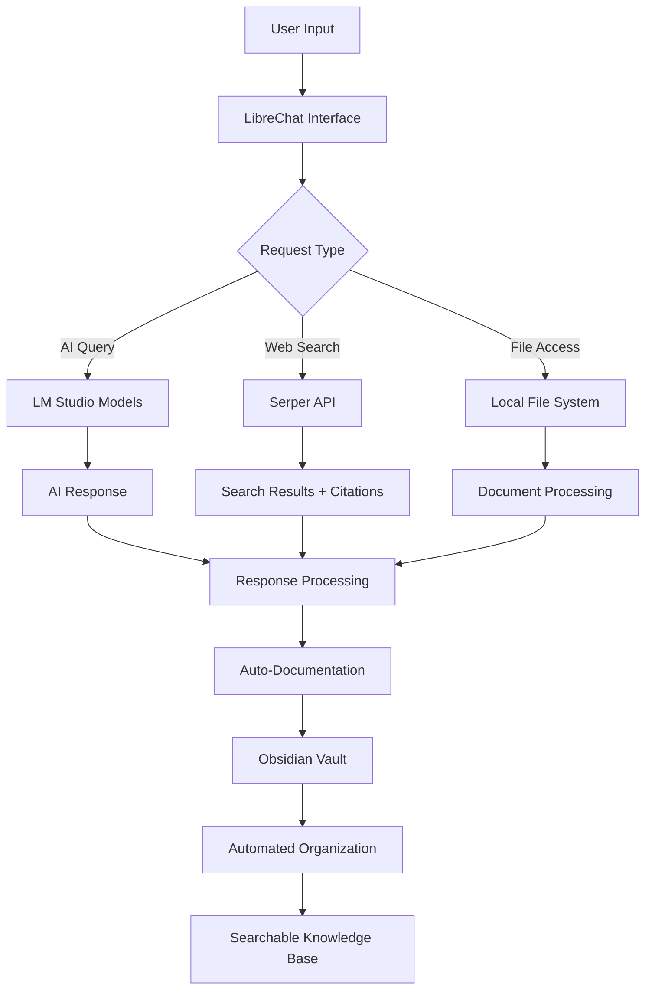

# Wiki How-To Navigation Index

**Created:** 2025-09-14 21:48:00
**Purpose:** Step-by-step guides for complete AI automation stack
**Security Note:** All sensitive data (API keys, passwords) have been sanitized

## 🎯 Complete Implementation Guide

This wiki contains everything needed to replicate our complete AI automation and knowledge management system.

### 📋 Implementation Order

Follow these guides in order for best results:

1. **[[01-LibreChat-Setup]]** - Docker deployment and basic configuration
2. **[[02-LM-Studio-Integration]]** - Local AI model setup and networking
3. **[[03-Web-Search-Integration]]** - Perplexity-style search with citations
4. **[[04-Obsidian-Organization]]** - Vault setup and file management
5. **[[05-Automation-Scripts]]** - Universal file organization system
6. **[[06-Local-File-Processing]]** - Backend file access and RAG integration

### 🏗️ Architecture Overview



### 🔧 System Requirements

**Hardware:**
- 16GB+ RAM (recommended 32GB)
- RTX 4080 or equivalent GPU (16GB VRAM)
- 500GB+ free storage
- Stable internet connection

**Software:**
- Ubuntu 22.04+ or Windows 11 with WSL2
- Docker and Docker Compose
- Git
- Python 3.10+
- Node.js 18+

### 🚀 Quick Start

For experienced users who want to deploy everything quickly:

1. Clone configurations from this wiki
2. Run setup scripts in order
3. Configure API keys (following security templates)
4. Deploy Docker stack
5. Run automation scripts
6. Verify all integrations

**Estimated Setup Time:** 2-3 hours for complete implementation

### 📚 Detailed Guides

#### Phase 1: Core Infrastructure
- **LibreChat Setup** - Docker deployment, environment configuration
- **LM Studio Integration** - Model loading, network configuration
- **Basic Testing** - Verify AI functionality

#### Phase 2: Enhanced Features
- **Web Search Integration** - Serper API, citation system
- **File Processing** - Local file access, RAG configuration
- **Security Hardening** - API key management, network isolation

#### Phase 3: Automation & Organization
- **Obsidian Integration** - Vault mounting, permissions
- **Automation Scripts** - File organization, metadata tagging
- **Monitoring & Maintenance** - Log management, updates

### 🔐 Security Guidelines

**API Key Management:**
- Use environment variables only
- Never commit keys to version control
- Rotate keys regularly
- Use separate keys for development/production

**File System Security:**
- Read-only mounts for sensitive directories
- Proper user permissions
- Container isolation
- Regular security updates

**Network Security:**
- Localhost-only binding for sensitive services
- Docker network isolation
- Firewall configuration
- VPN for remote access

### 🐛 Troubleshooting

Common issues and solutions are documented in each section:

- **Docker networking problems** - See LibreChat Setup
- **LM Studio connection issues** - See LM Studio Integration
- **Search not working** - See Web Search Integration
- **File organization failures** - See Automation Scripts
- **Performance optimization** - See system requirements

### 📊 Success Metrics

After completing this guide, you should have:

- ✅ LibreChat running with local AI models
- ✅ Perplexity-style web search with citations
- ✅ Automated conversation archiving to Obsidian
- ✅ Universal file organization system
- ✅ Searchable knowledge base with metadata
- ✅ Local file processing without internet dependencies

### 🤝 Contributing

Found an issue or improvement?

1. Document the problem clearly
2. Provide solution or workaround
3. Test your changes
4. Submit updates following our templates

### 📋 Checklist Templates

Each guide includes completion checklists:

- [ ] Prerequisites verified
- [ ] Configuration completed
- [ ] Testing successful
- [ ] Integration verified
- [ ] Documentation updated

---

## 📁 Directory Structure

```
04-Wiki-How-To/
├── 01-LibreChat-Setup/
│   ├── docker-deployment.md
│   ├── environment-configuration.md
│   └── basic-testing.md
├── 02-LM-Studio-Integration/
│   ├── model-setup.md
│   ├── network-configuration.md
│   └── api-integration.md
├── 03-Web-Search-Integration/
│   ├── serper-api-setup.md
│   ├── citation-configuration.md
│   └── search-optimization.md
├── 04-Obsidian-Organization/
│   ├── vault-setup.md
│   ├── file-mounting.md
│   └── permissions-security.md
├── 05-Automation-Scripts/
│   ├── file-organizer-setup.md
│   ├── metadata-tagging.md
│   └── script-customization.md
└── 06-Local-File-Processing/
    ├── backend-configuration.md
    ├── rag-integration.md
    └── performance-optimization.md
```

## 🚀 Quick Navigation

### 📚 Complete Guide Links
1. **[LibreChat Docker Deployment](01-LibreChat-Setup/docker-deployment.md)** - Docker deployment and basic configuration
2. **[LM Studio Model Setup](02-LM-Studio-Integration/model-setup.md)** - Local AI model integration
3. **[Serper Web Search](03-Web-Search-Integration/serper-api-setup.md)** - Perplexity-style search integration

### 🔧 Additional Resources
- **[Complete Process Flow](../02-Content-Ideas/Complete-AI-Automation-Flow.excalidraw)** - Visual architecture diagram
- **[LinkedIn Content Ideas](../02-Content-Ideas/LinkedIn-Post-Ideas-2025-09-14.md)** - Social media content
- **[Repository Enhancement Plan](../02-Content-Ideas/ConvoCanvas-Repository-Enhancement-Plan.md)** - Development roadmap

### 📊 Implementation Status
- ✅ **Phase 1:** Core Infrastructure (LibreChat, LM Studio, Web Search) - **COMPLETE**
- 🚧 **Phase 2:** Knowledge Management (Obsidian, File Processing) - **IN PROGRESS**
- 📋 **Phase 3:** Advanced Automation (Scripts, Monitoring) - **PLANNED**

**Ready to Start?** Begin with **[Docker Deployment Guide](01-LibreChat-Setup/docker-deployment.md)**